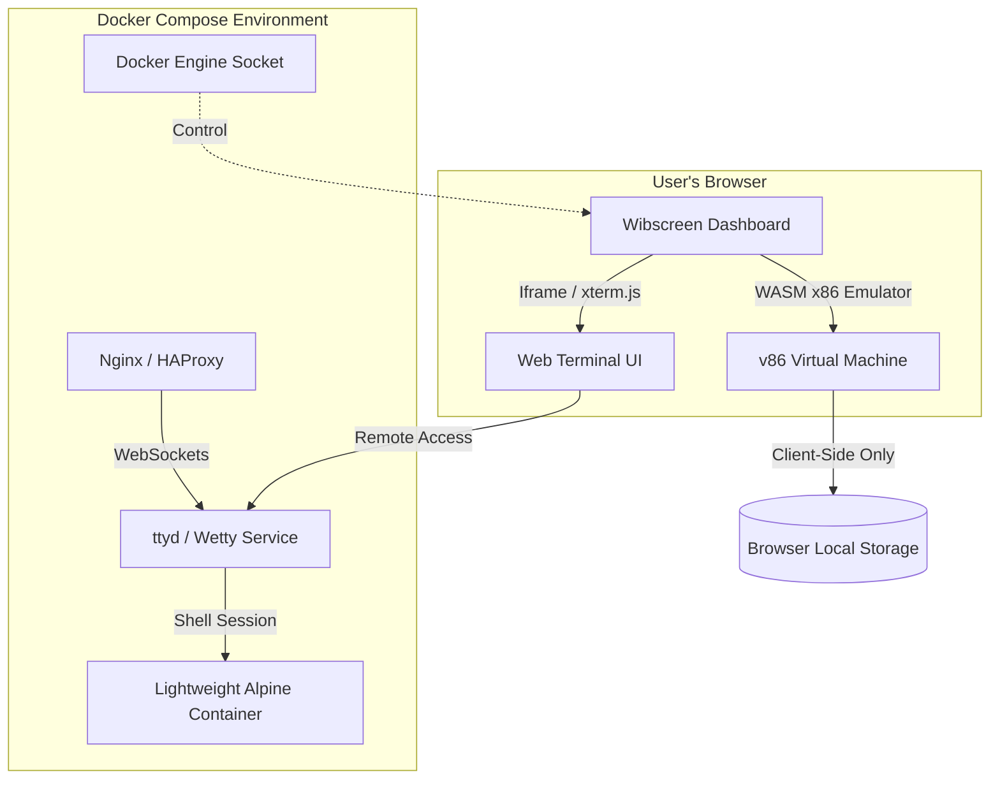

# Wibscreen Browser-Based Linux & Docker Integration Architecture

Wibscreen aims to provide a unified digital workspace. Integrating a lightweight Linux VM and terminal directly in the web browser allows users to run commands, run scripts, and manage environments without leaving the application.

This document describes the architecture, technology stack, and implementation options for running a Linux VM (< 50MB) and Docker Compose management tools directly inside the browser.

---

## ── Architecture Overview ──

We propose two primary methods to enable browser-based Linux environments within Wibscreen:



### 1. Client-Side WASM VM (Option A)

* **Technology:** [v86](https://github.com/copy/v86) (a 32-bit x86 emulator written in Rust/WebAssembly).
* **OS Image:** Alpine Linux 3.20 x86 Minimal (approx. 25MB - 35MB).
* **How it works:** The virtual machine runs entirely in the browser thread using WebAssembly. The Linux filesystem is loaded as a disk image from the server and cached in browser storage (IndexedDB).
*
* **Technology:** [ttyd](https://github.com/tsl0922/ttyd) (Share terminal over web using WebSockets and xterm.js) or WebSSH.
* **OS Image:** Ultra-lightweight `alpine:latest` (~5MB) running inside Docker Compose.
* **How it works:** A lightweight Alpine container is launched on the backend server. The `ttyd` process exposes the shell via WebSockets. The Wibscreen UI embeds `xterm.js` to render the terminal.
* **Pros:** Real Linux environment, full access to backend databases, Redis, and network services; extremely fast and reliable.
* **Cons:** Consumes server memory/CPU.

---

## ── Detailed Implementation Roadmap ──

### Phase 1: Browser-to-Docker Terminal Integration (Option B)

We will add a new lightweight terminal service to our existing `docker-compose.yml` that connects a terminal shell directly to your browser page.

1. **Add `terminal` service to `docker-compose.yml`:**

   ```yaml
     # Web-based Terminal Console for User Linux Shell
     terminal:
       image: tsl0922/ttyd:alpine
       container_name: wibscreen-terminal
       restart: unless-stopped
       expose:
         - "7681"
       volumes:
         - /var/run/docker.sock:/var/run/docker.sock # Optional: allows managing Docker from browser
       command: ttyd -p 7681 sh
       networks:
         - wibscreen-network
   ```

2. **Expose Terminal via Nginx/HAProxy Proxy:**
   We will update `nginx.conf` to proxy `/terminal` WebSocket requests to the `terminal` service:

   ```nginx
   location /terminal/ {
       proxy_pass http://terminal:7681/;
       proxy_http_version 1.1;
       proxy_set_header Upgrade $http_upgrade;
       proxy_set_header Connection "Upgrade";
       proxy_set_header Host $host;
   }
   ```

3. **Embed in Wibscreen Dashboard:**
   We will create a new terminal tab in the dashboard that displays the shell inside an iframe or uses `xterm.js` to render it in a clean card.

---

### Phase 2: Client-Side WebAssembly VM (Option A)

To run a completely self-contained Linux virtual machine (< 50MB) entirely client-side:

1. **Host v86 Assets:**
   We will download `v86.js` and `v86.wasm` to `public/assets/vendor/v86/`.
2. **Alpine Disk Image:**
   We will provide a custom, optimized Alpine Linux disk image (`alpine-v86.img` ~30MB) containing basic shell tools, and place it in the `Linux/` folder.
3. **HTML5 Terminal Interface:**
   We will write a Blade view `resources/views/pages/linux.blade.php` that initializes `v86` with the disk image and binds it to a terminal emulator interface in the browser.

---

## ── Current Workspace Diagnostics ──

* **Web Server URL:** `http://localhost:8000/`
* **Varnish Cache:** `http://localhost:8082/`
* **HAProxy Load Balancer:** `http://localhost:8083/`
* **Redis Instance:** `wibscreen-redis` (port 6379)
* **Mailpit:** `http://localhost:8025/`

---

## ── Next Steps ──

1. **Review this Plan:** Please read this design document.
2. **Confirm Preference:** Let us know if you want to start with **Option A (WASM VM running in browser)**, **Option B (Docker Terminal exposed via ttyd)**, or **both**.
3. **Download Linux Image:** Once confirmed, we will set up the files inside this `Linux/` folder and proceed with the integration.
