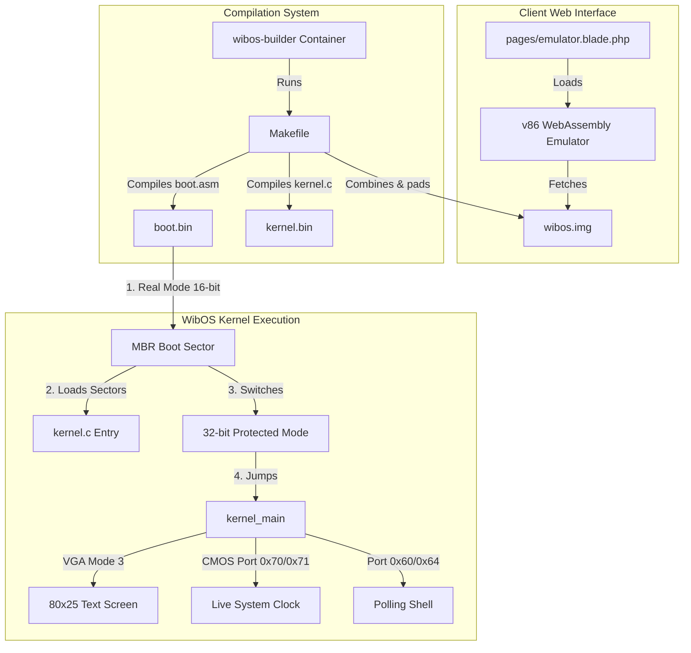

# Wibscreen Custom x86 Bootloader & C Kernel Architecture

This document describes the design, compilation flow, and runtime architecture of the custom 32-bit x86 Operating System (WibOS) running inside the browser-based v86 WebAssembly emulator.

---

## 1. System Architecture

### Key Components
1. **Bootloader (`boot.asm`)**: A 16-bit Real Mode assembly program located in the first sector (512 bytes) of the disk image (MBR). Its job is to load the kernel into memory, switch the CPU to 32-bit Protected Mode, and jump to the C kernel entry point.
2. **Kernel Entry (`kernel_entry.asm`)**: A small assembly bridge that imports the C `kernel_main` function and calls it once the CPU enters 32-bit Protected Mode.
3. **Linker Script (`linker.ld`)**: Tells the linker how to align sections and where the kernel code should be loaded in memory (physically at `0x10000`).
4. **C Kernel (`kernel.c`)**: The core OS logic. It writes directly to VGA text memory (`0xB8000`), handles keyboard scancodes, implements system commands, and queries the motherboard CMOS real-time clock.

---

## 2. Compilation Flow

Since Windows hosts do not natively run ELF/i386 GCC toolchains, compilation is handled inside a Docker container:

1. **nasm** compiles `boot.asm` directly to raw 16-bit binary machine code (`boot.bin`).
2. **gcc** compiles `kernel.c` into a 32-bit freestanding object file (`kernel.o`).
3. **ld** links `kernel_entry.o` and `kernel.o` into an ELF binary (`kernel.elf`) using the layout specified in `linker.ld`.
4. **objcopy** extracts the raw machine code of the kernel into `kernel.bin`.
5. **cat & dd** combine `boot.bin` and `kernel.bin` into a standardized 1.44MB floppy disk image (`wibos.img`).

---

## 3. Visual Layout & User Experience

The operating system displays an 80x25 text console inside the browser with the following sections:

* **Top Status Bar (Row 0)**: Displays system uptime in seconds, system name, and a live clock synced directly with the host system's hardware clock via CMOS RTC ports `0x70` and `0x71`.
* **Centered Logo (Rows 2-7)**: A beautifully centered ASCII art logo representing the system.
* **Boot Log Sequence (Rows 9-18)**: Simulates real-time system tests and module loading (GDT setup, A20 gate, memory allocation, shell mount) with colored status badges.
* **Console Shell (Rows 20-23)**: An interactive keyboard-driven shell allowing users to execute bare-metal commands (`help`, `about`, `clear`, `matrix`, `beep`, `color`, `reboot`, `shutdown`).
* **Bottom Info Bar (Row 24)**: Quick guide for system commands.
